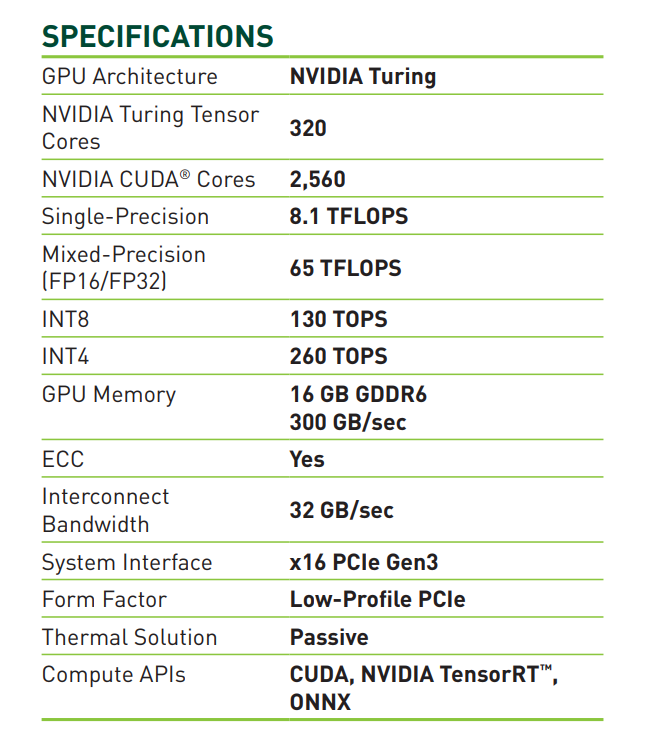

# Administrator guide

## Design
### kubeflow
在训练及部署神经网络应用的时候，往往无法将程序与硬件完全解耦。尤其是当多人在同一
机器上使用不同版本tensorflow 时，会需要首先安装对应版本的驱动和cuda 环境，这会给
很多初学者带来困扰。 

基于Docker 的硬件虚拟化和插件可以让每个用户构筑适合于自己程序的独立运行环境镜
像，能很好地解决cuda 版本的兼容性。但这需要用户学习一系列的前置技能，在目前天文
领域学生的知识结构下，难以真正推广。

[Kubeflow](https://www.kubeflow.org/)提供了另外一种解决方案。kubeflow 将docker
虚拟化，k8s 编排技术， istio以及jupyter notebook 等相结合，提供了一个比较容易上
手的、具有可视化notebook 界面的工作环境。对于初级用户来说，其将低层复杂的技术细
节全部隐藏起来，只需要专注使用 jupyter notebook, 几乎不再有学习成本。对于高级用
户，其提供了 Pipeline 用于定制自己的工作流，方便自动化完成更复杂的操作。对于管理
者，其提供了基于 Dex 的用户认证方式。

然而，由于kubeflow 是基于开源社区的解决方案，其中包含大量开源软件及技术细节，会
给部署带来一定麻烦。在部署kubeflow 的过程中，我发现官方文档存在许多问题，并且主
要针对云服务商，在本地机器部署的时候往往无法简单重复就实现相应功能，因此在下面对
部署过程进行详细记录。

### Machine
我们的机器暂时拥有4块
[T4](https://www.nvidia.com/content/dam/en-zz/Solutions/Data-Center/tesla-t4/t4-tensor-core-datasheet-951643.pdf)
GPU, 两块Intel(R) Xeon(R) CPU E5-2650 总共 24 核 48 线程，250G 内存以及相应的储
存系统。因为是单独的机器，暂时没必要真正组建计算集群，这里我选择
[k3s](https://k3s.io/) 作为k8s 部署的替代品。



## Install docker and k8s
### Install docker
You can install docker following [this
page](https://docs.docker.com/engine/install/ubuntu/) or use the below commands 
```
cd ansible
pip install ansible
ansible-galaxy install -r requirements.yml
ansible-playbook -i inventory main.yml -b -K --limit "ccg"
```

### Install k3s
1. Download the binary file from [this
   page](https://github.com/k3s-io/k3s/releases).  Here, I use the version of
   [v1.20.7+k3s1](https://github.com/k3s-io/k3s/releases/download/v1.20.7%2Bk3s1/k3s)
   and have uploaded it to http://nexus.nova.ccg/repository/raw-host/k3s/k3s.
1. download `install.sh`
   ```
   wget http://nexus.nova.ccg/repository/raw-host/k3s/k3s
   chmod u+x k3s
   sudo mv k3s /usr/local/bin/
   ```
1. install:
   ```
   wget http://nexus.nova.ccg/repository/raw-host/k3s/install.sh
   chmod u+x install.sh
   
   INSTALL_K3S_SKIP_DOWNLOAD=true ./install.sh --docker \
   #--private-registry=/home/data/k3s/etc/registries.yaml \
   --data-dir=/home/data/k3s/var \
   --config=/home/data/k3s/etc/config.yaml
   ```
   Here, the `config.yaml` is 
   ```
   write-kubeconfig-mode: "0644"
   tls-san:
     - "gnova.ccg"
   node-label:
     - "gpu=true"
   ```
   To use kfctl command, you can set `export KUBECONFIG=/config/.kube/config.gnova` to change kubectl context.

### GPU device plugins
1. Follow [this
   page](https://docs.nvidia.com/datacenter/cloud-native/container-toolkit/install-guide.html#setting-up-nvidia-container-toolkit)
   to install `nvidia-docker2`
1. Add 
   ```
   "default-runtime": "nvidia",
   "runtimes": {
           "nvidia": {
               "path": "nvidia-container-runtime",
               "runtimeArgs": []
           }
       }
   ``` 
   into `/etc/docker/daemon.json`
1. `sudo systemctl restart docker`
1. Test it by `docker run --rm --gpus all nvidia/cuda:11.0-base nvidia-smi`.
1. Add GPU device plugin for k3s 
   ```
   kubectl apply -f https://raw.githubusercontent.com/NVIDIA/k8s-device-plugin/v0.9.0/nvidia-device-plugin.yml
   ```

### Add DNS entry
Run `kubectl edit cm coredns -n kube-system`, add `192.168.3.14 login.gnova.ccg`
under `NodeHosts`, and then delete the coredns pod to reload the configmap.

## Deploy kubeflow
You can find more details from [this](https://v1-2-branch.kubeflow.org/docs/started/k8s/kfctl-istio-dex/).

### Set base dir
```
export kf_base_dir=/config/workspace/test/kf-ccg
export kf_conf_dir=${PWD}/config
```
### Download kfctl
```
cd $kf_base_dir
curl http://nexus.nova.ccg/repository/raw-host/kubeflow/tools/kfctl_v1.2.0-0-gbc038f9_linux.tar.gz --output $kf_base_dir/kfctl_v1.2.0.tar.gz
tar xvf $kf_base_dir/kfctl_v1.2.0.tar.gz -C $kf_base_dir
```
### Set env var
```
source config/env.sh
```
change `localPath` item in `${KF_DIR}/kfctl_istio_dex.yaml`

### build
```
kfctl build -V -f ${CONFIG_FILE}
```
### generate replaced images
由于国内的网络环境，通常无法直接访问 `gcr.io` 等google 仓库中的镜像。这里我写了
一个脚本利用github action pull and push them to docker.io, 这样不需要科学上网就
可以访问镜像。由于我不知道的原因，kubeflow 中许多镜像的版本并没有被固定住，而是
被设定为 `latest`, 这往往易产生由于镜像升级导致的兼容性的问题。鉴于kubeflow 的官
方文档往往不能够很直接地帮助我将kubeflow 部署到自己的机器上，这加重了我对未来一
些镜像版本升级导致系统无法正常工作的担忧。因此，在这里我对所有 `latest` 镜像添加
了自己的 `tag`,具体数值为本仓库对应版本。这有可能损失镜像升级带来的安全性提升，但
好处在于由此引发兼容性问题的可能也被排除了。由于我们的机器运行在内网，因此我认为
這些潜在的安全问题并不突出。

`set_image_name.py`脚本的使用方式有两种。

1. 如希望更新被push 到 docker.io 中的镜像，执行如下命令并将
  `replace_images.yaml` 文件包含在git 变更中，添加新的 tag 并推送至github, 此时
  github action 会拉取并上传新镜像。
  ```
  cd tools
  python set_image_name.py --dry-run > replace_images.yaml
  ```
2. 如不做镜像版本变更，只需执行如下命令更新 `kustomize` 中的镜像版本配置
  ```
  cd tools
  python set_image_name.py
  ```

### manually download some images:
注意，由于kubeflow 中许多镜像版本直接被写进了文件，难以通过 kustomize 配置文件
批量改动，在kubeflow 部署后还需要手动上传如下镜像到机器本地。

- gcr.io/kubeflow-images-public/kubernetes-sigs/application:1.0-beta
- gcr.io/istio-release/proxy_init:release-1.3-latest-daily
- gcr.io/istio-release/proxyv2:release-1.3-latest-daily
- gcr.io/ml-pipeline/minio:RELEASE.2019-08-14T20-37-41Z-license-compliance
- gcr.io/ml-pipeline/frontend:1.0.4
- gcr.io/ml-pipeline/visualization-server:1.0.4

方法如下：
``` 
docker save gcr.io/ml-pipeline/visualization-server:1.0.4 > image.tar
docker load < image.tar
```

### Edit the configuration files
需要更改 kustomize 中的 `dex`, `oidc-authservice`, `kubeflow-apps` 目录以配置
github oidc 登陆认证。参考 `config/dex` 等。

### apply
```
kfctl apply -V -f ${CONFIG_FILE}
```


### pvc
#### create local storage with dynamic pvc
```
kubectl apply -f pvc/local-path-storage.yaml
```
#### nfs data volume for shared data
为了使每个用户可以在jupyter notebook 中挂载nova nfs 数据卷，必须为每个user
profile 创建相应的pv 和 pvc, 详细操作参考[这里](#data-vol).

- https://stackoverflow.com/questions/63864416/kubernetes-2-pvcs-in-2-namespaces-binding-to-the-same-pv-one-successful-one-f
- https://v1-2-branch.kubeflow.org/docs/distributions/kfctl/multi-user/#provisioning-of-persistent-volumes-in-kubernetes

## Create accounts
### Add user to github team
Add user email to CCG-ML/flow-user member

### User create profile
为了便于管理，我选择手动为每个用户在开通时设置相应的Profile 权限，这可以方便限制
用户可以调动的资源。先由kubeflow 自带的profile自动生成系统产生profile,然后手动修
改资源权限也可以达到同样的目的，但这会使管理员的工作流程变复杂。

然而由于我不知道的原因，发现手动生成的profile 会让
`ml-pipeline-visualizationserver` 和 `ml-pipeline-ui-artifact` 无法正常运行，这
或许是因为 `serviceaccounts` 等设置不合理[See it: Profile creation through
central dashboard vs kubectl YAML does not have the same
behavior](https://github.com/kubeflow/kubeflow/issues/4965). 

以上问题或许会导致kubeflow pipeline 无法正常工作，但 jupyter notebook 目前已经足
够满足需求，所以问题留待以后有时间再解决。

用于生成profile 的脚本参见 [这里](#profile_pvc).

#### An example for profile
```
apiVersion: kubeflow.org/v1beta1
kind: Profile
metadata:
  name: user-<profileName>   # replace with the name of profile you want, this will be user's namespace name
spec:
  owner:
    kind: User
    name: /user/userid@email.com   # replace with the email of the user

  resourceQuotaSpec:    # resource quota can be set optionally
    hard: #mid
      cpu: "24.5"
      memory: 128Gi
      requests.nvidia.com/gpu: "2"
      persistentvolumeclaims: "5"
      requests.storage: "500Gi"
```
Add profile by 
```
kubectl create -f profile.yaml
```

#### profile design
You can get or edit profiles use these commands.
```
kubectl get profiles
kubectl edit profile ${NAME}
```
由于机器多人共用，这里设置了三种不同的资源限制以满足不同用户的需求。

1. 临时人员： 短期使用或者有较小的计算资源需求，如本科生，实习生等
  ```
  # small level
  hard:
    cpu: "12.5"
    memory: 64Gi
    requests.nvidia.com/gpu: "1"
    persistentvolumeclaims: "5"
    requests.storage: "100Gi"
  ```
1. 一般人员： 长期使用，但没有重度并行计算需求，如研究生和工作人员
  ```
  # mid level
  hard:
    cpu: "24.5"
    memory: 128Gi
    requests.nvidia.com/gpu: "2"
    persistentvolumeclaims: "5"
    requests.storage: "500Gi"
  ```
1. 需要额外的计算资源： 有相关需求请联系管理员手动修改权限
  ```
  # big level
  hard:
    cpu: "32.5"
    memory: 250Gi
    requests.nvidia.com/gpu: "4"
    persistentvolumeclaims: "5"
    requests.storage: "1Ti"
  ```

### shared data volume
<a name="data-vol"></a>
Create file `pvc.yaml`:
```
apiVersion: v1
kind: PersistentVolume
metadata:
  name: inspur-disk01-userName
  labels:
    node: nova
    disk: inspur-disk01
    user: userName
    type: nfs
spec:
  capacity:
    storage: 10G
  accessModes:
    - ReadOnlyMany
  persistentVolumeReclaimPolicy: Retain
  storageClassName: data-vol
  nfs:
    server: nova
    path: "/data/inspur_disk01/userdir/gnova"
    readOnly: true
---
apiVersion: v1
kind: PersistentVolumeClaim
metadata:
  name: data-vol
  namespace: userName
spec:
  accessModes:
    - ReadOnlyMany
  storageClassName: data-vol
  resources:
    requests:
      storage: 1G
  selector: 
    matchLabels:
      node: nova
      disk: inspur-disk01
      user: userName
      type: nfs
```
and run
```
kubectl apply -f pvc.yaml
```

### profile and pvc script
<a name="profile_pvc"></a>
为了方便起见，我写了一个脚本用于生成新用户对应的profile 以及 mount shared volume.
```
cd profile
python user_init.py --user test --email test@gmail.com --level mid --mode all
```
用于查看生成的配置文件。
```
cd profile
python user_init.py --user test --email test@gmail.com --level mid --mode all | kubectl apply -f -
```
用于部署生成的配置文件。

## tls (TODO)
tls 可以通过https 加密协议保障安全，但直接配置后发现https url 访问无法直接连通，
由于时间有限，tls 配置留待之后有时间再解决。
```
kubectl create secret tls login.gnova.ccg.tls --cert=ssl/cert.pem --key=ssl/key.pem -n auth
```


## References
1. https://towardsdatascience.com/deploying-kubeflow-to-a-bare-metal-gpu-cluster-from-scratch-6865ebcde032
1. https://github.com/kubeflow/manifests/issues/974#issuecomment-785654391
1. https://github.com/kubeflow/manifests/blob/51b0e3f8f35053181ca5a357c4273cacd67c1df9/common/dex-auth/README.md#server-setup-instructions
1. https://github.com/kubeflow/kfctl/releases/download/v1.0.2/kfctl_v1.0.2-0-ga476281_linux.tar.gz
1. https://github.com/kubeflow/kfctl/issues/402#issuecomment-723301913
1. https://github.com/kubeflow/manifests/issues/1549#issuecomment-690822049
1. https://github.com/cockroachdb/cockroach/issues/28075#issuecomment-420497277
1. https://github.com/discordianfish/kubeflow-manifests/blob/master/dex-auth/README.md
1. https://github.com/kubeflow/manifests/tree/v1.2-rc.0/dex-auth
1. https://github.com/kubeflow/manifests/issues/1835#issue-856401284
1. https://github.com/arrikto/oidc-authservice/pull/20
1. https://superuser.com/questions/565409/how-to-stop-an-automatic-redirect-from-http-to-https-in-chrome
1. https://docs.nvidia.com/datacenter/cloud-native/container-toolkit/install-guide.html#getting-started
1. https://docs.docker.com/config/daemon/systemd/#httphttps-proxy
1. https://github.com/NVIDIA/k8s-device-plugin#quick-start
1. https://illya13.github.io/RL/tutorial/2020/05/03/install-kubeflow-on-single-node-kubernetes-v1.18.2.html

## nexus raw repositories
- http://nexus.nova.ccg/repository/raw-host/
- http://nexus.nova.ccg/repository/raw-host/kubeflow/tools/v1.2-branch.tar.gz
- http://nexus.nova.ccg/repository/raw-host/kubeflow/tools/kfctl_v1.2.0-0-gbc038f9_linux.tar.gz
- http://nexus.nova.ccg/repository/raw-host/kubeflow/tools/kfctl_istio_dex.v1.2.0.yaml
