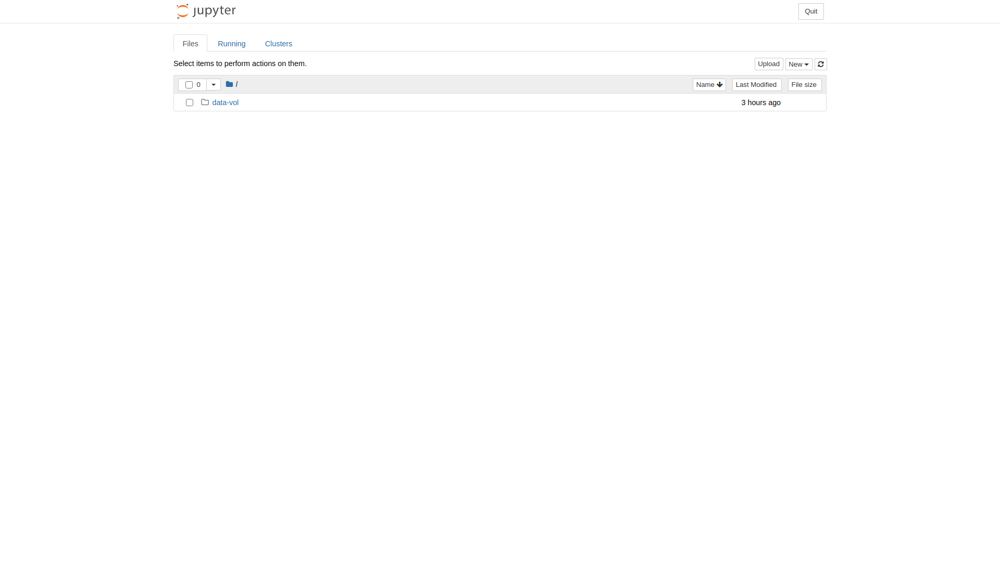

# User guide for gnova

gnova 的机器学习工作环境借助 kubeflow 部署，更多细节请参考[官方文档](https://v1-2-branch.kubeflow.org/docs).

由于手边没有Mac 尤其是 Windows 电脑，本文档只在linux 下经过测试，其他系统上使用
如果有问题请及时反馈。


Table of Contents
=================

  * [Quick start](#sec_quick_start)
    * [申请账号](#sub_sec_accounts)
    * [建立连接](#sub_sec_connect)
    * [登陆](#sub_sec_login)
    * [创建 notebook](#sub_sec_create_notebook)
    * [使用和测试](#sub_sec_use_and_test)
  * [资源](#sec_resources)
  * [数据](#sec_data)
  * [Notebook parameters](#notebook-pars)
  * [Tips](#Tips)
  * [Troubleshooting](#Troubleshooting)


## Quick start
<a name="sec_quick_start"></a>

### 申请账号
<a name="sub_sec_accounts"></a>

1. 向[管理员](mailto:mtianxiang@gmail.com)发送邮件申请账号，其中应包括

   - 姓名
   - github.com 的注册邮箱
   - 常用邮箱地址，如与上条相同则不需要
   - 希望申请的用户名，英文简写并且无特殊字符

1. 登陆 nova, 执行如下命令创建用于数据交换的目录
   <a name="create-data-vol"></a>
   ```
   mkdir /data/inspur_disk01/userdir/gnova/<userName>
   ```
   其中 `<userName>` 应改为申请的用户名

### 建立连接
<a name="sub_sec_connect"></a>
由于机器没有外网ip，需要使用nova 进行跳转，所以使用本机器的前提是拥有nova 账号。

1. 在 `/etc/hosts` 文件中添加如下一行
   ```
   127.0.0.1  login.gnova.ccg
   ```

1. Linux or Mac 打开 terminal, Windows 可以使用 `PowerShell`, 输入如下命令：
   ```
   ssh -L login.gnova.ccg:31380:gnova:31380 user@nova
   ```

   <span style="color:LightCoral">注意，如果处于单位内网，应该使用nova 的内网ip 连接, 会使连接更稳定。</span>

   如果执行以上命令发现通过nova 外网访问过于不稳定，可以尝试如下命令建立连接，需要自行安装 `autossh`
   ```
   autossh -fCNL login.gnova.ccg:31380:gnova:31380 user@nova
   ```

1. 测试是否连通可以使用 `curl login.gnova.ccg:31380` 命令，得到如下信息表示已经连通服务器。
   ```
   <a href="/dex/auth?......">Found</a>.
   ```

### 登陆
<a name="sub_sec_login"></a>

1. 打开浏览器，输入 `http://login.gnova.ccg:31380`,按照提示登陆github 账号即可跳
   转至如下页面。如果未能顺利跳转请多试几次。


1. 授权登陆后，会跳转到kubeflow 控制面板。


注意，由于国内连接 github.com 不稳定，如果登陆过程中遇到如下情况或者显示 `i/o timeout`, 多重复几次或一段时间后再试即可。


### 创建 notebook
<a name="sub_sec_create_notebook"></a>
注意，在进入 `Notebook Servers` 时，由于默认需要访问 `*.fonts.googleapis.com`,因
此这一步需要科学上网，同时对 `login.gnova.ccg` 的访问应该不通过代理进行。 (Need more
details here? Anyone can help to add something?...)

在按照如下步骤创建 notebook 实例后，之后可以通过
`http://login.gnova.ccg:31380/notebook/user-<userName>/<notebook name>/tree` 直接访
问，而不需要代理。

1. 点击 `Notebook Servers` 进入 jupyter notebook 控制面板
   

1. 点击右上角 `NEW SERVER` 按钮创建新的 notebook. 其中需要填写并注意的参数依次分别为
   - Name -> Name
   - Image -> Image
   - CPU/RAM -> CPU & Memory
   - GPUs -> Number of GPUs & GPU Vendor
   - Workspace Volume 
   - Data Volume

   其中大部分可以保留默认值 (默认值按 [mid 权限](#profile-par) 设置)，具体参数设
   置请参考[这里](#notebook-pars).

1. 点击 `LAUNCH` 创建 notebook 实例并等待一段时间直到status 变为成功。
   

1. 点击 `CONNECT` 连接 notebook 即可正常使用
   

### 使用和测试
<a name="sub_sec_use_and_test"></a>
此处以 tensorflow 2.1 为例，参考[这里](exam/tf-exam.md).

## 资源
<a name="sec_resources"></a>

### 硬件
我们的机器暂时拥有4块
[T4](https://www.nvidia.com/content/dam/en-zz/Solutions/Data-Center/tesla-t4/t4-tensor-core-datasheet-951643.pdf)
GPU, 两块Intel(R) Xeon(R) CPU E5-2650 总共 24 核 48 线程，250G 内存以及相应的储
存系统。T4 的具体参数如下


### 资源分配
由于机器多人共用，这里设置了三种不同的资源权限以满足不同的需求。

1. 临时人员(small)： 短期使用或者有较小的计算资源需求，如本科生，实习生等
1. 一般人员(mid)： 长期使用，但没有重度并行计算需求，如研究生和工作人员
1. 全部的计算资源(big)： 有相关需求请联系管理员修改权限，参考 [Troubleshooting](#Troubleshooting)

相应的资源权限如下表。
<a name="profile-par"></a>

| key        | small | mid   | big   |
|:----------:|:-----:|:-----:|:-----:|
| cpu        | 12    | 24    | 32    |
| memory     | 64Gi  | 128Gi | 250Gi |
| gpu number | 1     | 2     | 4     |
| storage    | 100Gi | 500Gi | 1Ti   |


## 数据
<a name="sec_data"></a>

日常使用中跟数据相关的储存载体有两类，一种是本地储存 (高速)，另一种是 nova 通过千兆网络
共享的 NFS 储存（低速）。用户在具体使用过程中不需要关心具体的储存载体的实现方式，但需要
了解它们的区别以建立合理的 [workflow](#Tips).

<span style="color:DarkCyan">
每个用户所拥有的全部数据卷的总大小参考[这里](#profile-par), 能够创建的数据卷总数
目前被设置为 5. 在创建 notebook server 时是否挂载，以及删除notebook 等操作都
<span style="color:LightCoral"> **不会** </span>删除数据卷中的数据。</span>

### NFS 共享卷
nova 的 NFS 共享卷被命名为 `data-vol`, 在创建notebook server 时，其默认设置在
data volumes 下，其主要作用是方便从nova 中将数据转移到 notebook 可访问的路径。

<span style="color:LightCoral">请注意 </span>，由于 data-vol 是通过千兆网络连接
的，其读取速度远远不足以用于直接训练神经网络，会造成严重的资源浪费。正确的做法是
先将数据从 data-vol 中拷贝到其他数据卷再进行使用。

在nova 中， data-vol 对应的路径为
`/data/inspur_disk01/userdir/gnova/<userName>`. 在向管理员申请 gnova 访问权限时，
首先应登陆 nova 并在 `/data/inspur_disk01/userdir/gnova` 下
[创建与用户名相同的目录](#create-data-vol)。<span
style="color:DarkCyan">data-vol 被设置为只读权限。 </span>

### 本地高速储存
除 data-vol 外的全部储存都是本地高速储存。在创建 notebook server 时，需要设置两
种储存卷： workspace volume and data volume.

#### workspace volume
workspace volume 被挂载到 `/home/jovyan`, 也就是进入 notebook 时所处的 HOME 目录。
这里是用户主要的工作区域和保存信息的位置。 workspace volume 在配置 notebook 时会
根据设置的notebook server 的 name 自动生成或选择已存在的数据卷。大小可以在配置时
设定。

#### data volumes
data volumes 是用来储存数据的附加卷。在创建 notebook server 时，data-vol 会默认
被添加在这里，当然也可以手动删除。用户可以按需求挂载或添加不同大小的数据卷。

## Notebook parameters
<a name="notebook-pars"></a>
Notebook server 配置时参数的具体意义如下

### Name
Name: 生成的 jupyter notebook 的名字

### Image
Image: notebook 运行环境镜像，目前可选镜像为

- txmao/kubeflow-images-public-tensorflow-2.1.0-notebook-cpu:1.0.0
- txmao/kubeflow-images-public-tensorflow-2.1.0-notebook-gpu:1.0.0
- txmao/kubeflow-images-public-tensorflow-1.15.2-notebook-cpu:1.0.0
- txmao/kubeflow-images-public-tensorflow-1.15.2-notebook-gpu:1.0.0

### CPU/RAM
notebook 可以使用的 CPU 和 RAM 资源，用户拥有的全部notebook server 资源总量受[权
限](#profile-par)限制。

### GPUs

- Number of GPUs: 根据[权限](#profile-par)设置，small 权限用户注意默认值可能过大。
- GPU Vendor: 选择 nvidia

### Workspace Volume
建议使用默认设置，但可改动大小。全部数据卷总大小受[权限](#profile-par)限制，尤其
small 权限的用户应该注意，默认值相对权限可能过大。

### Data Volume
用于储存数据的卷，建议除 data-vol 外，根据需求设置data volume, 全部数据卷
总大小受[权限](#profile-par)限制。


## Tips
<a name="Tips"></a>

1. 可以使用 `nvidia-smi` 察看拥有的 GPU 资源以及使用状态
1. notebook server 下的 terminal 很有用，进入后执行 bash 命令会用起来更方便
1. 本机器主要用于训练神经网络，data clean 和数据预处理等不需要 GPU 资源的工作应
   该在其他机器上完成，并将训练样本通过 data-vol 拷贝到其他高速储存卷下
1. 对训练数据进行预处理以尽可能减小其大小，这有助于数据传输和训练加速
1. data-vol 没有写权限，如果结果很小可以直接通过 notebook 直接下载。如果过大无法
   取出请联系管理员


## Troubleshooting
<a name="Troubleshooting"></a>
如果遇到系统问题无法解决，如无法创建 notebook，请将下列信息邮件发送管理员。

- 用户名
- github 注册邮箱
- 问题描述 
- 期望结果
- 请察看 http://login.gnova.ccg:31380/activity, 将其中的信息复制或截图
